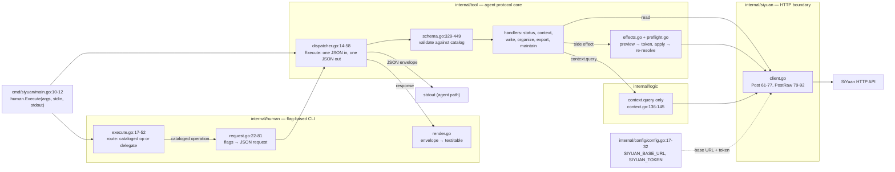

# Architecture

The executable is a layered CLI over the SiYuan HTTP API. Each layer has a single responsibility and depends only on the layers below it.

```
cmd/siyuan        entry point
internal/human    flag-based command line (human path)
internal/tool     agent protocol core: catalog, dispatch, preview/apply
internal/logic    reusable business operations (used where behavior combines calls)
internal/siyuan   SiYuan API client, the HTTP boundary
internal/config   environment configuration
```

## Layers

- `cmd/siyuan` — process entry point. `main` calls `human.Execute` with the arguments and standard streams (`cmd/siyuan/main.go:10-12`).
- `internal/human` — adapts the agent protocol to a flag-based CLI. It routes cataloged operations through a `--flag value` path and delegates everything else unchanged to the agent dispatcher (`internal/human/execute.go:17-52`). It builds the JSON request from the operation schema (`internal/human/request.go:22-81`), renders responses as text (`internal/human/render.go`), and drives the preview-then-apply prompt for side effects (`internal/human/execute.go:109-143`).
- `internal/tool` — owns the agent contract. `schema.go` defines `FieldSchema`, `OperationSchema`, and `Schema`, publishes the catalog with per-operation applicability and examples, and validates requests (`internal/tool/schema.go:12-34`, `71-165`, `329-449`). The request and response envelope live in `protocol.go`. The error codes and sorted candidates live in `error.go`. `dispatcher.go` reads one strict JSON request from stdin, dispatches on the top-level tool name, and writes exactly one JSON response (`internal/tool/dispatcher.go:15-58`). Handlers live one file per tool: `status.go`, `context.go`, `write.go`, `organize.go`, `export.go`, `maintain.go`. Shared helpers resolve notebook, tag, and document selectors before any API call: `resolveNotebookForRequest` and `resolveTagForRequest` in `effects.go:335-407`, `resolveDocumentForRequest` in `selector.go:25-44`.
- `internal/logic` — reusable operations and transformations behind the API client. Each domain exposes a `New*Logic` constructor (`internal/logic/attr.go:16-22`). Tool handlers use it where behavior combines calls. Today only the SQL query path uses it (`internal/tool/context.go:136-145`).
- `internal/siyuan` — the HTTP boundary. `Client` sends POST requests with `Authorization: Token <token>` (`internal/siyuan/client.go:138-160`) and decodes the SiYuan envelope `{code, msg, data}` (`internal/siyuan/client.go:61-77`). `PostRaw` serves endpoints that return file content instead of the envelope (`internal/siyuan/client.go:79-92`). API methods are grouped per domain: `asset.go`, `attr.go`, `block.go`, `client.go`, `document.go`, `export.go`, `file.go`, `notebook.go`, `search.go`, `snapshot.go`, `sql.go`, `system.go`, `tag.go`, `template.go`, `types.go`.
- `internal/config` — reads environment configuration. `SIYUAN_BASE_URL` defaults to `http://127.0.0.1:6806`. `SIYUAN_TOKEN` is required (`internal/config/config.go:17-32`).

`internal/utils/output` is legacy formatting code. Do not use it for tools (`internal/utils/output/output.go:1-2`).

## Request flow

Two invocation styles share one request and response core:

1. Agent path: `siyuan-cli <tool>`, one JSON request on stdin, one JSON response on stdout. `internal/tool.Execute` validates the request against the catalog and dispatches (`internal/tool/dispatcher.go:40-57`).
2. Human path: `siyuan-cli <tool> <operation> --flag value`. `internal/human` converts the flags into a request using the operation schema, runs it through the same tool layer, and renders the response as text (`internal/human/execute.go:54-75`). `--json` prints the raw agent envelope.

Side-effecting operations apply only after preview. `internal/tool` resolves operation-owned remote or local preconditions, fingerprints target state, and issues a confirmation token on preview. Apply re-resolves the same targets and fails closed if the state changed or cannot be inspected (`internal/tool/effects.go`, `internal/tool/preflight.go`).

Notebook selectors accept an ID or an exact name, and tag selectors an exact label. Every selector binds to a stable identity before any API call: no match is `NOT_FOUND`, and multiple matches are `AMBIGUOUS_SELECTOR` with sorted candidates. Apply re-resolves the selector so the mutation binds to the identity that preview fingerprinted. If the target changed or disappeared, apply returns `CONFIRMATION_STALE` before mutating. Preview issues a token only when it can inspect target state. An uninspectable local export destination, for example, returns `PRECONDITION_UNAVAILABLE`.

Errors stay in one response envelope. `error` carries `code`, `message`, `fix`, `retryable`, and sorted `candidates` when a selector is ambiguous. Success data is decision-relevant: list operations return a `count`, and mutations return resolved identities (stable IDs, canonical paths, byte sizes) so an agent can chain follow-up operations without re-resolving.

## Flow



The agent path flows `MAIN → EXEC → SCHEMA → HANDLER` and prints one JSON envelope. The human path enters through `ROUTE`, converts flags to the same request, and renders the envelope as text. Side effects branch through `EFFECT`, so apply mutates only with a previewed, fingerprint-bound token.

_Diagram last regenerated 2026-08-12. Refresh it when the handler or client boundaries change._

## Tools

The catalog exposes six tools plus the `tools` discovery command: `status` and `context` read server state and note data. `write`, `organize`, `export`, and `maintain` preview side effects before apply (`internal/tool/schema.go:71-165`). Every operation documents when to use it and when not to, and shows a representative example. The executable has no command tree beyond these cataloged operations.

## Exceptions

- Like every handler, `runStatus` creates the client through the shared `clientOrError` helper (`internal/tool/status.go:5`, `internal/tool/dispatcher.go:112-118`). It stays in the tool layer because it reads only server state.
- The `context.query` operation is the only handler that goes through `internal/logic` (`internal/tool/context.go:136-145`).

## Verification

`make build` writes `dist/siyuan-cli`. `make test` runs unit and package tests without a live server. `make test-integration` requires `SIYUAN_INTEGRATION_TEST=1` and a real instance. `make lint-arch` runs the repository checks in `scripts/lint-deps.go` and `scripts/lint-quality.go` (Makefile:28-30).
